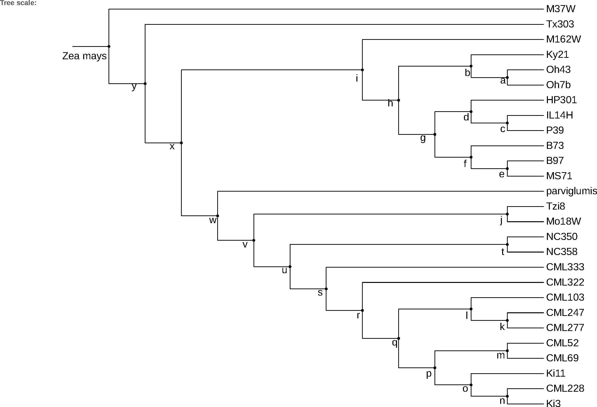

# Gene prediction, orphan identification and analysis for maize NAM line workflow:


## De novo transcriptome assembly:

**De novo transcriptome assembly**: Create transcriptome directly from alignment of RNA-Seq without the aid of reference genome.

1. Prepare RNA-Seq dataset:

    - Use RNA-Seq dataset with known metadata from our collabrated lab for 25 NAM founder lines and B73.
    - Download more RNA-Seq data for B73 from NCBI-SRA:
        - Search RNA-Seq datasets for Zea mays subsp. mays (taxid:381124), filter Runs for Illumina, paired-end, B73, and exclude samples with miRNA-Seq, ncRNA-Seq, or RIP-Seq library strategies.
        - Download metadata and SRR IDs from SRA Run Selector.
        - Download RNA-Seq samples by [`01downloadSRR.sh`](scripts/01downloadSRR.sh).
        
```bash
# Download RNA-Seq data by SRR ID in the SRR_list.txt
while read line; do
    ./01downloadSRR.sh ${line};
done<SRR_list.txt
```

2. Preprocess for RNA-Seq data:

    - Delete adapter sequence and do quality triming by [BBDuk](https://jgi.doe.gov/data-and-tools/bbtools/bb-tools-user-guide/bbduk-guide/) using script [`02bbduk.sh`](scripts/02bbduk.sh)
    
```bash
#Clean RNA-Seq fastq file by SRR ID in the SRR_list.txt
while read line; do
    ./02bbduk.sh ${line};
done<SRR_list.txt
```

3. Prepare genome sequence:

    - We used RefGen_v5 assembly for B73 downloaded from [MaizeGDB B73_v5](https://download.maizegdb.org/Zm-B73-REFERENCE-NAM-5.0/Zm-B73-REFERENCE-NAM-5.0.fa.gz). 
    - Other genome sequence for 25 NAM lines also downloaded from [MaizeGDB NAM-genomes](https://www.maizegdb.org/NAM_project).
    
4. RNA-Seq alignment:
    - We used Hisat2 to align RNA-Seq data to the genome sequence.
    - We used samtools to convert sam file to bam file and sort bam file by location (by script [`03alignment.sh`](scripts/03alignment.sh)).
    
 ```bash
 # RNA-Seq alignment by SRR ID in the SRR_list.txt
while read line; do
    ./03alignment.sh ${line};
done<SRR_list.txt
 ```
 
 5. Determine the stranded information:
 
    - Many public data don't have detailed strand information for the RNA-Seq samples. We need to use different option for stranded-specific and unstranded libraries.
    - In order to determine an RNA-Seq library stranded or not, we used `infer_experiment.py` in [RSeQC](http://rseqc.sourceforge.net/#infer-experiment-py) to check the strand specification for each library (by script [`04strand.sh`](scripts/04strand.sh)).
    
 ```bash
# Determine strand specific by SRR ID in the SRR_list.txt, keep the strand information in the strand_info.txt.
while read line; do
    ./04strand.sh ${line};
done<SRR_list.txt > strand_info.txt
```

      In the strand_info.txt, --fr means read 1 comes from the forward strand, --rf means read 1 comes from the reverse strand. 
  
 6. De novo transcriptome assembly:
  
    - Use the sorted BAM files with multiple transcript assemblers for genome guided transcript assembly:
        - [StringTie](https://ccb.jhu.edu/software/stringtie/index.shtml): [`05stringtie.sh`](scripts/05stringtie.sh)
        - [Cufflinks](http://cole-trapnell-lab.github.io/cufflinks/cuffdiff/): [`06cufflinks.sh`](scripts/06cufflinks.sh)
        - [Class2](https://github.com/mourisl/CLASS): [`07class2.sh`](scripts/07class2.sh)
        - [Strawberry](https://github.com/ruolin/strawberry): [`08strawberry.sh`](scripts/08strawberry.sh)
        - [Trinity](https://github.com/trinityrnaseq/trinityrnaseq/wiki): [`09trinity.sh`](scripts/09trinity.sh)

```bash
# Prepare a file with a column of SRR ID and a column of strand information, seperate by space.
# Different assembler may used different string to present the specific strand. 
# For example, stringtie use --rf for fr-first strand, and --fr for fr-secondstrand.

while read line; do
    ./05stringtie.sh ${line};
done<stringtieSRR.txt
```
        
   
 ## Ab Initio prediction:

**Ab Initio**: Gene predictions based on signal detection and seqeunce information only.

1. Merge the sorted bam files in to a single file [`10mergeBAM.sh`](scripts/10mergeBAM.sh).
2. Here we used braker for ab inito prediction [`11braker.slurm`](scripts/11braker.slurm).

    *Note: To run braker in hpc cluster, you should copy the AUGUSTUS BIN, SCRIPTS AND CONFIG folder to a path where you can edit, and export the path.*

    
## Combine Direct Inference and ab Initio prediction:

**Direct Inference (DI):** Gene predictions inferred directly from alignment of RNA-Seq evidence to the genome, that is, from de novo transctiptomes.

Here, we used [mikado v2.0.2](https://github.com/EI-CoreBioinformatics/mikado) to determine and select the best RNA-seq prediction, and combine with the ab initio prediction.

1. Quantify and select the high quality splicing site by [portcullis](https://github.com/maplesond/portcullis) ([`12portcullis.sh`](scripts/12portcullis.slurm))

    *Note: Portcullis v1.2.2 only can be installed from docker and singularity.*
    
    ```bash
    # In ISU hpc, we download the container though singularity.
    singularity pull docker://maplesond/portcullis:stable
    # Then excute the container by 
    singularity exec portcullis_stable.sif portcullis [--option]
    ```
   
 2. Make a mikado configuration and score file, extract and remove redundant transcripts from all predcitons ([`13mikado_1.slurm`](scripts/13mikado_1.slurm)).
 
    Here, we need a list with all transcript `list.txt` with such a format:
    
    ```bash
    SRR5166171_class2.gtf  SRR5166171_class2.gtf      True
    SRR5166171_cufflinks.gtf       SRR5166171_cufflinks.gtf      True
    SRR5166171_strawberry.gtf      SRR5166171_strawberry.gtf      True
    SRR5166171_stringtie.gtf       SRR5166171_stringtie.gtf      True
    SRR5166171_trinityGG-mapped.gff3       SRR5166171_trinityGG-mapped.gff3      True
    ```
    
    The the second column is an alias with the file, third column is stranded or not.

    In our case, we revised the configuration.yaml for such option:
    
    ```bash
    # Revised the minimal ORF length 
    orf_loading:
        minimal_orf_length: 50
        minimal_secondary_orf_length: 50
    # We choose nosplit mode, and want to keep all ORFs if any ORFs overlapped.
    output_format:
        report_all_orfs: true
    # Also change the braker ab initio prediction to reference by change the fase to true under reference
    ```
    
    In our study, we want to predict orphan genes (species specific genes), which may have short CDS. So we revise the scoring file (plant.yaml), change the cutoff to cdna or cds length to 150nt.

3. We got mikado_prepared.fasta from step 2, and then used the file to predict ORFs by [TransDecoder](https://github.com/TransDecoder/TransDecoder/) ([`14transdecoder.slurm`](scripts/14transdecoder.slurm)).

    *Note: Mikado assume the ORFs information have high quality. However, transdecoder may predict some incomplete ORFs (lack of start or stop codon). We choose the padding option in mikado, it extends the shorter sequence to have the same length as longer one in the same locus, and may cause adding 3' UTR or 5' UTR on the incomplete ORFs. After comparing several options for mikado and transdecoder, we decided to keep only transcripts with complete ORFs for training and prediction in transdecoder. Therefore, we only got complete ORFs to use in mikado.*
    
4. As a final step, we will pick best transcripts for each locus and annotate them as gene using Mikado pick ([`15mikado_2.slurm`](scripts/15mikado_2.slurm)). 
   
   This will generate the output files:
   
   ```bash
   mikado.loci.metrics.tsv
   mikado.loci.scores.tsv
   mikado.loci.gff3
   ```
 
 5. Since we used unmasked genome, the predicted gene model may include TE sequence. We used [TEsorter](https://github.com/NBISweden/TEsorter) to identify and filter out TE sequence transcripts ([`16TEsoeter.sh`](scripts/16TEsoeter.sh)). 
 
    Here, we got a list of transcript ID (`TE-trans.txt`) matched to TE sequence. 
 
 6. Even though mikado remove some redundant transcripts in the prepare step, it still produce some redundant transcripts, which may not have exactly same transctipt seqeunce but have same CDS. We use [cd-hit](http://weizhongli-lab.org/cd-hit/) to identify these redundant sequence ([`17cd-hit.sh`](scripts/17cd-hit.sh)).
 
    Here, we got a list of non-redundant transctripts.
    
 
## Quantification of predicted CDS seqeunce:

We used [salmon](https://salmon.readthedocs.io/en/latest/index.html) to qunatify predicted CDS sequence in each RNA-Seq samples.

   *Note: Although we identified TE matched sequence, we still used all sequence from mikado to do quantification and phylostrata analysis. Therefore, we can compare the difference between TE-matched sequence and other sequence.
   
1. Create a salmon index by [`18salmon_index.sh`](scripts/18salmon_index.sh)

2. Quantify the tpm for each RNA-Seq samples by [`19salmon.sh`](scripts/19salmon.sh)

    ```bash
    # Determine strand specific by SRR ID in the SRR_list.txt. 
    while read line; do
        ./19salmon.sh ${line};
    done<SRR_list.txt 
    
    # Each RNA-Seq samples have an output folder, we used the TPM in quant.sf for future analysis.
    ```

## phylostrata analysis of predicted protein seqeunce:    

We used [phylostratr](https://github.com/arendsee/phylostratr) to assign an age to each predicted protein sequence. The phylogenic tree for maize NAM line could be found in [`NAM.tree`](data/NAM.tree). The script can be found here: [`20phylo.R`](scripts/20phylo.R)


